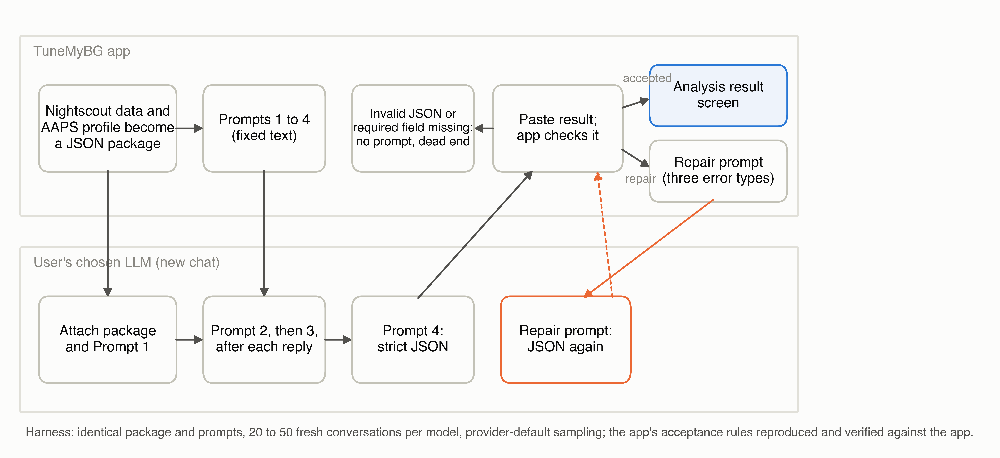
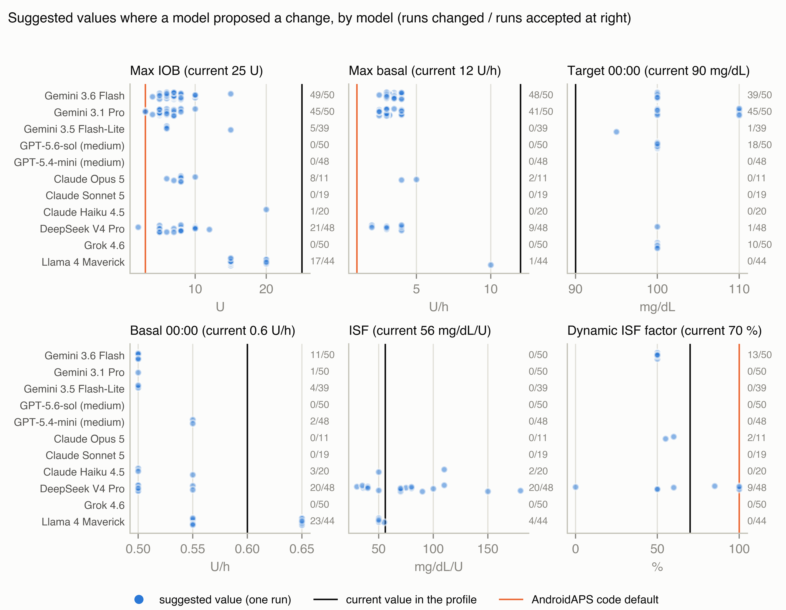

# A paid application standardises what large language models read about insulin pump settings and leaves what they decide to chance: reproducibility of an automated insulin delivery settings review across eleven models

Tim Street, MEng BEng (Hons), Diabettech Ltd, 44 Brandram Road, London SE13 5RT, United Kingdom. Telephone +44 7740 051 460. tim@diabettech.com

Corresponding author: Tim Street, Diabettech Ltd, 44 Brandram Road, London SE13 5RT, United Kingdom. tim@diabettech.com

Abbreviations: AID, automated insulin delivery; CGM, continuous glucose monitoring; DIA, duration of insulin action; IOB, insulin on board; ISF, insulin sensitivity factor; JSON, JavaScript Object Notation; LLM, large language model.

Keywords: AndroidAPS; artificial intelligence; automated insulin delivery; large language models; reproducibility; type 1 diabetes

3 figures, 3 tables. All graphics are originals created by the author.

## Abstract

Background. A paid Android application prepares a user's AndroidAPS data and four prompts for any large language model, checks the returned file and presents it as a settings review.

Method. The application's package and prompts were replayed verbatim against eleven models, 50 conversations per model (20 for two), on one adult's 14-day record. Responses were judged by a validator verified against the application's behaviour. Outcomes were whether quoted figures were in the record, agreement on 23 settings within and between models, and what the check accepted, with Wilson 95 per cent intervals.

Results. The models quoted the record accurately: 96.8 to 100 per cent of cited figures were in it. Three models lowered the maximum insulin on board limit in 73 to 98 per cent of accepted conversations, proposing 5 to 18 distinct value pairs; four left it alone throughout. One model proposed sensitivity factors from 30 to 180 mg/dl per unit against a current 56. Acceptance at first paste ranged from 34 per cent (22.4 to 47.8) to 100 per cent, and up to 17 of 20 accepted responses broke rules the prompts state but the check does not enforce.

Conclusions. A sensitivity factor three times the current value and a meal step marked completed on a record with no meals both passed the application's check. Which settings a user is told to change depended more on the model opened than on the data, and the user is given no means of telling which answer they have.

## Introduction

A person who runs an open-source automated insulin delivery (AID) system such as AndroidAPS sets their own basal rates, carbohydrate ratios, insulin sensitivity factors (ISF), duration of insulin action (DIA) and glucose targets, and the limits that bound what the algorithm may deliver [1]. Reviewing those settings against a fortnight of glucose data is skilled work, and some users now ask general-purpose large language models (LLMs) to do it between clinic appointments [2, 3]. By August 2026 an Android application had made the practice a product [4]. It builds a JavaScript Object Notation (JSON) package from the user's Nightscout instance and AndroidAPS profile, with a decision inventory of 23 settings, and supplies four prompts. The user opens a new conversation in whichever LLM they prefer, attaches the package with the first prompt, sends the rest in turn and pastes the final JSON response back into the application. The application checks it, returns the user to the conversation with a repair prompt if it fails, and otherwise renders a primary profile recommendation, a decision for every setting, a meal strategy and a list of recommendations; a subscription costs £4.49 a month, and no model is recommended.

The product rests on the promise that a model given a well-structured record will derive a review from it, and on the assumption that checking the review's form is enough to stand behind its content. General-purpose models answer diabetes questions fluently and sometimes wrongly [5], and their photograph-based carbohydrate estimates vary from query to query [6, 7, 8]. Asked to propose pump settings from a week of raw continuous glucose monitoring (CGM) and pump data, five models anchored on textbook values unless told the user's current settings, and 30 to 70 per cent of the glucose readings they cited were not in the data; the authors concluded that a deployment would need two safeguards, the user's settings as context and programmatic checking of what the model cites [9]. The Diabetes Technology Network UK has advised that any suggested change to a pump setting must be checked for plausibility before it is acted on [10]. The application supplies the first safeguard, since the package carries the current profile, and its check is a form of the second; what happens to the review once both are in place has not been measured.

This study replicated the application's workflow against eleven models, on one real record, and asked three questions in order: whether the models read the record correctly, whether they agreed about what to change, and what the application's check made of the difference. The product's regulatory position is taken up in a companion commentary.

## Methods

### Materials

The application studied was TuneMyBG, version 1.0.5 (Adam Kowalczyk, Lubliniec, Poland; distributed through Google Play) [4]; the package and the four prompts were copied verbatim from it. The application's source is not available, so its repair prompt and acceptance behaviour were established by pasting 25 real model outputs into the result screen. The application's synthetic demonstration package served as a control. The study package came from the author's own Nightscout instance and AndroidAPS profile: 14 days of CGM data, mean glucose 121.6 mg/dl, time in range 86.0 per cent, time below 70 mg/dl (3.9 mmol/L [11]) 5.1 per cent, 275.95 units of bolus and SMB insulin in its treatment records, and no carbohydrate entries, since the author does not log meals. The profile had a single ISF of 56 mg/dl per unit, overnight targets of 90 mg/dl, a DIA of 10 hours, a maximum basal of 12 U/h and a maximum insulin on board (IOB) of 25 U. Time below 70 mg/dl peaks at 18.5 per cent at 01:00 local time and has fallen to low single figures by 04:00 with the same basal segment running, which under a 10-hour DIA is more consistent with the tail of evening insulin than with the overnight basal or target; the reading is the author's interpretation.

One record was used by design. The question is whether the same input yields the same review, and holding the input fixed while the conversation is repeated attributes all observed variation to the model and the application. A study of whether the advice is correct would need many records and a reference standard, and is a different study. The data are the author's own, published with his written consent; no other person's data were involved and no institutional review board approval was sought. No change was made to any treatment.

### Replication of the workflow

Each conversation was fresh, with the package attached to the first prompt and the remaining prompts sent in turn. No sampling parameters were set; each provider's default applied. Eleven models were run on 21 and 22 August 2026: Gemini 3.6 Flash, Gemini 3.1 Pro Preview and Gemini 3.5 Flash-Lite (Google, Mountain View, California, USA); GPT-5.6-sol and GPT-5.4-mini at the medium reasoning setting (OpenAI, San Francisco, California, USA); Claude Opus 5, Claude Sonnet 5 and Claude Haiku 4.5 (Anthropic, San Francisco, California, USA); DeepSeek V4 Pro (DeepSeek, Hangzhou, China); Grok 4.6 (xAI, Palo Alto, California, USA); and Llama 4 Maverick (Meta, Menlo Park, California, USA), the last three through OpenRouter (New York, New York, USA). Fifty conversations ran per model, 20 for Opus and Sonnet because of cost, and the served model identifier was recorded for every turn (Supplementary Table S1). Conversations ran through the providers' programming interfaces, so the results describe the models rather than any chat product.

### The application's check and the repair loop

The application issues a repair prompt for three conditions: decision rows missing from or absent in the inventory, a current value not copied exactly, and a primary recommendation focus outside the five allowed words. It stops without a prompt when the paste is not valid JSON or a required string field is absent. It accepts everything else, including invalid enum words, missing sections and extra keys. The validator built from these observations reproduces the application's verdict on all 25 informative test pastes (Supplementary Table S2), and it, rather than the application, judged the study's responses. A repair prompt was sent once in the same conversation when needed, and each conversation was classified as accepted at first paste, accepted after repair, rejected with no prompt offered, or still rejected after repair; rules stated in the prompts but not enforced were recorded separately. Content analyses cover accepted conversations only; the application holds nothing from a rejected one.

### Outcome measures

Whether the models read the record was measured by checking every figure with a unit quoted in an accepted response against the numbers in the package, and by recording whether each response recognised the absence of carbohydrate data and how it scored the meal strategy step. Whether the models agreed was measured, for each of the 23 settings, by the proportion of accepted conversations proposing a change and the values proposed, and by a stability index, the mean proportion of conversations agreeing with the modal decision per setting. What the check made of it was measured by the acceptance classes and the proportion of accepted responses breaking an unenforced rule. Proportions carry Wilson 95 per cent intervals with the conversation as the unit. Within-model results are solid; the between-model comparison is provisional, since the models are versioned services; the reasons offered for the differences are interpretation. All analyses were specified before the runs except the carbohydrate-handling examination, the citation and per-decision citation checks, the reading of the overnight rationales, and the examination of how responses read the package's insulin total and other partial fields, all added after inspection of the outputs.

## Results

### What the models read

All 50 control-package conversations kept every setting unchanged; the remainder concerns the study record. The models quoted the record accurately (post hoc analysis): of the figures with a unit in accepted responses, 96.8 per cent (Opus) to 100 per cent (GPT-5.4-mini, Llama) were present in the package. Where a response changed a setting, the rationale cited at least one figure from the record in 85 to 100 per cent of changes for eight models, in 69 per cent for Gemini 3.1 Pro and in 5 per cent for Llama (Supplementary Table S3); no rationale quoted a figure that was absent from the record. Each model recognised that no carbohydrates had been logged in at least 70 per cent of its conversations (post hoc analysis). Only Llama changed a carbohydrate ratio; the others said the ratios could not be tested without meal data. The three models that acted on the safety limits cited the same arithmetic, a 25 U ceiling against 19.7 U of insulin a day, and both branches of the fork below cited the same figure, 18.5 per cent of readings below 70 mg/dl at 01:00. The 19.7 U is inherited: the package's insulin total sums only the bolus and SMB records, carries no basal delivery, and its scheduled basal adds 16.2 U a day (post hoc analysis; Supplementary Table S4). Flash took the bolus-only sum as the daily total in 49 of 50 conversations and lowered the limit in 48; GPT-5.4-mini, Haiku and Opus noted the omission in most of theirs; Opus reconstructed about 36 U a day in all 11.

### What the models concluded

Gemini 3.6 Flash, Gemini 3.1 Pro and Opus lowered the IOB limit in 98, 90 and 73 per cent of accepted conversations; four models left it alone throughout; DeepSeek and Llama lowered it in 44 and 39 per cent. Four models changed nothing in most conversations, GPT-5.4-mini and Sonnet among them.

Within a model the direction of a change was usually consistent and the number was not (Figures 2 and 3). Gemini 3.6 Flash lowered the IOB limit in 49 of 50 conversations (98 per cent, 89.5 to 99.6) and the basal limit in 48, proposing 18 distinct pairs of values. Gemini 3.1 Pro produced 17 distinct pairs and Opus, in 8 of 11 conversations (73 per cent, 43.4 to 90.3), five. Stability indices ranged from 0.915 (DeepSeek) and 0.928 (Haiku) to 0.998 (GPT-5.4-mini and Sonnet); an index of 1 would mean the same decision on all settings in all conversations; for the least stable model roughly one decision in twelve departed from the modal answer.

The primary recommendation also forked within a model: Gemini 3.6 Flash raised the two overnight targets from 90 to 100 mg/dl in 39 of 50 conversations (78 per cent, 64.8 to 87.2) and headed the result with "target"; in the other 11 it left the targets, cut the midnight basal from 0.6 to 0.5 U/h and led with "basal". Llama changed the midnight basal in 23 of 44 accepted conversations, raising it to 0.65 U/h in 16 and lowering it to 0.55 U/h in seven. DeepSeek changed the ISF in 20 of 48 (42 per cent, 28.8 to 55.7), proposing 14 distinct values from 30 to 180 mg/dl per unit against a current 56, a range that tracks the package's own dynamic sensitivity values, 37.9 to 124, and reads as anchoring on them rather than invention (interpretation).

The overnight lows themselves were read three ways (Table 3; post hoc analysis). Opus and Sonnet traced them to earlier insulin in 11 of 11 and 18 of 19 conversations, and neither changed the overnight target or basal. Gemini 3.1 Pro traced the lows to "massive late insulin stacking from evening UAMs" in 40 of 50 conversations and still raised the target in 45, 36 of them while naming the stacking. Llama offered no causal attribution in 18 of its 23 basal changes.

The meal strategy step, which had no meal data to work from, was marked completed by Flash-Lite, Llama and Haiku in 39 of 39, 43 of 44 and 20 of 20 conversations, and partial or blocked by GPT-5.6-sol, Opus and Sonnet in all but one.

### What the check caught

Table 1 gives the acceptance classes with intervals. Opus produced invalid JSON in nine of 20 conversations (45 per cent, 25.8 to 65.8) and Flash-Lite in 10 of 50 (20 per cent, 11.2 to 33.0); the application offers no way forward from that state. Llama recovered through the repair prompt in 25 of 50 conversations, whereas Haiku was still rejected after it in 27 of 50 (54 per cent, 40.4 to 67.0).

Nothing in the preceding section was caught: the check accepted all 40 safety-limit pairs, both branches of the Flash fork, both directions of the Llama basal change, all 14 DeepSeek sensitivity factors and each meal step marked completed on a record with no meals. Among accepted responses the proportion breaking a rule the prompts state but the check does not enforce ranged from none (GPT-5.6-sol) to 25 of 48 (GPT-5.4-mini) and 17 of 20 (Haiku), the commonest breaches being confidence words outside the allowed set, a missing issues section and extra keys, which reach the result screen.

## Discussion

On this record the review a user received depended more on which model they opened than on the data, and the application could not tell the difference. The models did not agree about what followed from the record: four models left the limits alone, three lowered them, one proposed sensitivity factors ranging over a factor of six, and one raised a basal rate that another lowered. Within a single model the direction held and the number did not. The overnight lows show the difference at its clearest: the same figure led two models to leave the overnight settings alone because earlier insulin explained it, two to raise the target as a cushion against it, and one to change the basal without offering a cause; only the first acts on what the record shows. Each answer was internally coherent and presented in the same form; nothing on the screen tells the user which they hold.

This is a different failure from the two seen with raw five-minute data, where settings anchored on training priors and cited readings were unreliable [9]. The package here carried the current profile and the check enforced the copying of current values, the two safeguards that paper proposed. The misquotation did not recur, and for eight of the eleven models nearly every change was argued from a figure in the record, for Gemini 3.1 Pro two thirds were; Llama changed settings without citing one, and DeepSeek's shortening of the DIA has the shape of the textbook anchoring seen before. The comparison is between two studies with different records, prompts and models, so it shows the earlier failures largely absent, not that the package removed them. The package also fixes what the models do not see: its insulin total omits basal delivery, and the model that cut the safety limits most often was the one that mistook the bolus-only sum for the whole. The models that read the total correctly did so from training, since knowing that an AID system delivers basal insulin is not in the package; the priors the earlier study treated as anchoring are also a model's means of questioning the data, and whether a draw applies them is itself sampled. Two smaller splits have the same shape: the hourly glucose is keyed in both UTC and local time, and 30 conversations placed the low band at the wrong clock hour; the diluted insulin is disclosed only in a profile name string, which 90 conversations noticed (Supplementary Table S5). What the models argued from the record was not stable: with good evidence they generate several plausible conclusions and the sampling decides which is shown. A structured package appears to fix what the model reads and to leave untouched what it decides, and the product sells the decision.

The application's check is a check of form: the identity of the decision table, the copying of current values and one enumerated field. It does not inspect a proposed value, a status, a confidence word or the content of a recommendation, so a meal step marked completed on a record with no meals appears as the model wrote it, and an ISF of 180 mg/dl per unit passes as readily as one of 56. The prompts contain rules against most of this, but they are instructions to the model rather than checks, and the cheaper models broke them in a quarter to four fifths of accepted responses.

None of this is cured by a temperature setting: the chat interfaces expose none, and non-determinism persists at temperature zero [12]. A design that took the variation seriously would run the analysis several times, show the spread, and validate and pin one model rather than accept any. The advice that every suggested change be checked for plausibility before it is acted on [10] assumes a user who can recognise which of several plausible answers they hold, and the application's screen gives them no means of doing so.

A profile with different problems might be treated differently. The application was withdrawn from Google Play after these findings were published in late August 2026, a sequence the developer confirmed to the author (personal communication); the analysis describes the product as sold. The validator reproduces the application's behaviour on 25 informative tests but could differ on untested cases. The study measured consistency, not correctness: there is no reference answer for these settings and no counterfactual glucose trajectory for any change, so what is reported is what the models produced, not what would have followed had a user acted. The safety concern is therefore epistemic rather than a claim that any particular answer was mistaken.

## Conclusions

Eleven models quoted one glucose record accurately and returned reviews that differed in substance between models and in detail within them, and the application that sells the review accepted all of them. A single review from such a product is one sample from a distribution whose shape the user is not shown. A developer who sells one answer should first measure the spread and disclose it, and a user who receives one should treat it as a hypothesis rather than a finding.

## Funding

This research received no specific grant from any funding agency in the public, commercial, or not-for-profit sectors. Model usage for the study, $158.42 plus £19.73, was paid for by the author.

## Acknowledgments

Claude (Anthropic, San Francisco, California, USA), a large language model assistant, was used under the author's direction to write the harness and analysis code, to run the analyses, to prepare the figures and to draft and revise the text. The author specified the study, made every decision of design and interpretation, checked each reported number against the stored outputs, and is responsible for the content.

## Disclosures

The author runs Diabettech Ltd, is a committee member of the Diabetes Technology Network UK and wrote its statement on large language models, and is the author of the two SSRN preprints cited. He has no relationship with the developer of the application studied and paid for its subscription. Three of the eleven models studied are Anthropic's, as is the assistant used to produce this work; Anthropic had no role in the study, was not informed of it, and all model usage was paid for at list price.

## Data accessibility

The prompts, the harness, the validator, the analysis code, every transcript and model output, and the package with identifiers removed are published in the study repository. The package is the author's own health data and is released with his written consent.

## References
1. AndroidAPS documentation. https://androidaps.readthedocs.io. Accessed 21 August 2026.
2. Street T. In conversation with: factual questions for large language models. Diabettech. 21 June 2025. https://www.diabettech.com/ai/in-conversation-with-factual-questions-for-large-language-models/. Accessed 22 August 2026.
3. Street T. ChatGPT "Health" conversations and a Boost AndroidAPS case study. Diabettech. 8 January 2026. Accessed 22 August 2026.
4. Kowalczyk A. TuneMyBG. Google Play. Version 1.0.5, updated 20 August 2026. https://play.google.com/store/apps/details?id=com.adamkowalczyk.tunemybg. Accessed 22 August 2026; listing removed by 24 August 2026.
5. Sng GLY, Tung JYM, Lim DYZ, Bee YM. Potential and pitfalls of ChatGPT and natural-language artificial intelligence models for diabetes education. Diabetes Care. 2023;46:e103-5.
6. Goncalves S, Coelho C, Pretre L, et al. Chat, Gemini and Claude at the dinner table: assessing general-purpose AI tools for carbohydrate counting in type 1 diabetes. Diabetes Res Clin Pract. 2025;113031. https://doi.org/10.1016/j.diabres.2025.113031
7. Joubert M, Dreves B, Arnould T, et al. Comparative accuracy of smartphone apps and a generative AI tool for carbohydrate counting: an independent bicentric study. Diabetes Obes Metab. 2026. https://doi.org/10.1111/dom.70396
8. Street T. Reproducibility and accuracy of large language model vision APIs for carbohydrate estimation from food photographs: a four-model batch comparison with implications for automated insulin dosing. SSRN preprint. 2026. https://doi.org/10.2139/ssrn.6577780
9. Street T. Frontier LLMs require explicit clinical context to avoid training-data anchoring for insulin pump settings: a pre-registered exploratory study. SSRN preprint. 2026. https://doi.org/10.2139/ssrn.6619638. Pre-registration: OSF, 10.17605/OSF.IO/Q4UX9.
10. Diabetes Technology Network UK. DTN-UK statement on large language models. Association of British Clinical Diabetologists. January 2026. https://abcd.care/dtn/resource/current/dtn-uk-statement-large-language-models. Accessed 22 August 2026.
11. International Hypoglycaemia Study Group. Glucose concentrations of less than 3.0 mmol/L (54 mg/dL) should be reported in clinical trials: a joint position statement of the American Diabetes Association and the European Association for the Study of Diabetes. Diabetologia. 2017;60:3-6. https://doi.org/10.1007/s00125-016-4146-6
12. Yuan J, Li H, Ding X, et al. Understanding and mitigating numerical sources of nondeterminism in LLM inference. In: Advances in Neural Information Processing Systems 38 (NeurIPS 2025). 2025. https://openreview.net/forum?id=Q3qAsZAEZw

## Tables

Table 1. Acceptance of the final response by the application, by model: conversations; accepted at first paste, with Wilson 95 per cent interval; accepted after the repair prompt; rejected with no prompt offered (invalid JSON or a required field absent); still rejected after repair; accepted responses breaking a rule the prompts state but the application does not check; stability index over accepted conversations.

| Model | n | Accepted first paste, n (per cent; 95 per cent interval) | After repair | No prompt offered | Still rejected | Accepted but breaking a prompt rule | Stability index |
|---|---|---|---|---|---|---|---|
| Gemini 3.6 Flash | 50 | 50 (100; 92.9 to 100) | 0 | 0 | 0 | 4 of 50 | 0.951 |
| Gemini 3.1 Pro | 50 | 50 (100; 92.9 to 100) | 0 | 0 | 0 | 3 of 50 | 0.983 |
| Gemini 3.5 Flash-Lite | 50 | 38 (76; 62.6 to 85.7) | 1 | 11 | 0 | 6 of 39 | 0.989 |
| GPT-5.6-sol | 50 | 50 (100; 92.9 to 100) | 0 | 0 | 0 | 0 of 50 | 0.983 |
| GPT-5.4-mini | 50 | 48 (96; 86.5 to 98.9) | 0 | 1 | 1 | 25 of 48 | 0.998 |
| Claude Opus 5 | 20 | 10 (50; 29.9 to 70.1) | 1 | 9 | 0 | 5 of 11 | 0.972 |
| Claude Sonnet 5 | 20 | 18 (90; 69.9 to 97.2) | 1 | 1 | 0 | 2 of 19 | 0.998 |
| Claude Haiku 4.5 | 50 | 17 (34; 22.4 to 47.8) | 3 | 3 | 27 | 17 of 20 | 0.928 |
| DeepSeek V4 Pro | 50 | 45 (90; 78.6 to 95.7) | 3 | 2 | 0 | 14 of 48 | 0.915 |
| Grok 4.6 | 50 | 50 (100; 92.9 to 100) | 0 | 0 | 0 | 1 of 50 | 0.986 |
| Llama 4 Maverick | 50 | 19 (38; 25.9 to 51.8) | 25 | 2 | 4 | 5 of 44 | 0.953 |

Table 2. Settings any model changed in more than 10 per cent of accepted conversations. Each cell gives the percentage of accepted conversations proposing a change, with the range of suggested values in parentheses; 0 means no conversation proposed a change. Accepted conversations: Gemini 3.6 Flash 50, Gemini 3.1 Pro 50, Gemini 3.5 Flash-Lite 39, GPT-5.6-sol 50, GPT-5.4-mini 48, Claude Opus 5 11, Claude Sonnet 5 19, Claude Haiku 4.5 20, DeepSeek V4 Pro 48, Grok 4.6 50, Llama 4 Maverick 44. Current values: maximum IOB 25 U; maximum basal 12 U/h; target at 00:00 90 mg/dl; basal at 00:00 0.6 U/h; ISF 56 mg/dl per unit; dynamic ISF factor 70 per cent; DIA 10 h. AndroidAPS code defaults: maximum IOB 3 U, maximum basal 1 U/h, dynamic ISF factor 100 per cent; profile rows have no code default.

| Model | Max IOB (U) | Max basal (U/h) | Target 00:00 (mg/dl) | Basal 00:00 (U/h) | ISF (mg/dl per unit) | Dynamic ISF factor (per cent) | DIA (h) |
|---|---|---|---|---|---|---|---|
| Gemini 3.6 Flash | 98 (4 to 15) | 96 (2.5 to 4) | 78 (100) | 22 (0.5) | 0 | 26 (50) | 0 |
| Gemini 3.1 Pro | 90 (3 to 10) | 82 (2.5 to 4) | 90 (100 to 110) | 2 (0.5) | 0 | 0 | 0 |
| Gemini 3.5 Flash-Lite | 13 (6 to 15) | 0 | 3 (95) | 10 (0.5) | 0 | 0 | 0 |
| GPT-5.6-sol | 0 | 0 | 36 (100) | 0 | 0 | 0 | 0 |
| GPT-5.4-mini | 0 | 0 | 0 | 4 (0.55) | 0 | 0 | 0 |
| Claude Opus 5 | 73 (6 to 10) | 18 (4 to 5) | 0 | 0 | 0 | 18 (55 to 60) | 0 |
| Claude Sonnet 5 | 0 | 0 | 0 | 0 | 0 | 0 | 0 |
| Claude Haiku 4.5 | 5 (20) | 0 | 0 | 15 (0.5 to 0.55) | 10 (50 to 110) | 0 | 5 (6) |
| DeepSeek V4 Pro | 44 (2 to 12) | 19 (2 to 4) | 2 (100) | 42 (0.5 to 0.55) | 42 (30 to 180) | 19 (0 to 100) | 17 (5 to 8) |
| Grok 4.6 | 0 | 0 | 20 (100) | 0 | 0 | 0 | 0 |
| Llama 4 Maverick | 39 (15 to 20) | 2 (10) | 0 | 52 (0.55 to 0.65) | 9 (50 to 55) | 0 | 0 |

Table 3. How the accepted conversations read the overnight lows: attribution to earlier insulin (the tail of evening dosing, stacking, carry-over or residual IOB) or to the target or basal itself, against whether the conversation changed the target at 00:00 or 23:00 or the basal at 00:00. A conversation may attribute to both. Wilson 95 per cent intervals in brackets.

| Model | n | Attributes lows to earlier insulin | Attributes lows to target or basal | Changed overnight target or basal | Changed despite attributing to earlier insulin | Changed with no causal attribution |
|---|---|---|---|---|---|---|
| Gemini 3.6 Flash | 50 | 21 (42; 29 to 56) | 45 (90; 79 to 96) | 44 (88; 76 to 94) | 16 | 3 |
| Gemini 3.1 Pro | 50 | 40 (80; 67 to 89) | 42 (84; 71 to 92) | 45 (90; 79 to 96) | 36 | 2 |
| Gemini 3.5 Flash-Lite | 39 | 1 (3; 1 to 13) | 16 (41; 27 to 57) | 5 (13; 6 to 27) | 0 | 2 |
| GPT-5.6-sol | 50 | 35 (70; 56 to 81) | 47 (94; 84 to 98) | 18 (36; 24 to 50) | 9 | 1 |
| GPT-5.4-mini | 48 | 14 (29; 18 to 43) | 35 (73; 59 to 83) | 2 (4; 1 to 14) | 0 | 0 |
| Claude Opus 5 | 11 | 11 (100; 74 to 100) | 11 (100; 74 to 100) | 0 (0; 0 to 26) | 0 | 0 |
| Claude Sonnet 5 | 19 | 18 (95; 75 to 99) | 14 (74; 51 to 88) | 0 (0; 0 to 17) | 0 | 0 |
| Claude Haiku 4.5 | 20 | 15 (75; 53 to 89) | 19 (95; 76 to 99) | 3 (15; 5 to 36) | 1 | 0 |
| DeepSeek V4 Pro | 48 | 26 (54; 40 to 67) | 47 (98; 89 to 100) | 20 (42; 29 to 56) | 6 | 1 |
| Grok 4.6 | 50 | 34 (68; 54 to 79) | 42 (84; 71 to 92) | 10 (20; 11 to 33) | 6 | 0 |
| Llama 4 Maverick | 44 | 0 (0; 0 to 8) | 5 (11; 5 to 24) | 23 (52; 38 to 66) | 0 | 18 |

## Figures

Figure 1. The application's workflow as replicated: the package and four prompts go to a new conversation in the user's chosen model; the fourth response is pasted back; the application accepts it, issues a repair prompt for three error types, or stops without a prompt when the paste is not valid JSON or a required field is absent.

Figure 2. Suggested values in accepted conversations that proposed a change, by model, for six settings, against the current value and the AndroidAPS code default; the count at the right of each row is conversations that changed the setting over conversations accepted.

Figure 3. Every conversation as one cell, in the order run. Top: the maximum IOB limit each conversation proposed, by model, with darker blue for lower values, grey where the limit was left at 25 U and hatching where the application rejected the response; the boxed cell marks one conversation, which is what a user receives. Middle: the ISF proposed by DeepSeek V4 Pro in the 20 conversations that changed it, against the current 56 mg/dl per unit. Bottom: the focus of Gemini 3.6 Flash's primary recommendation in each of its 50 conversations.
